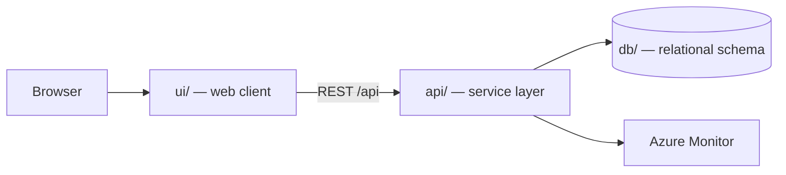

# Tutorial Field service Work Orders

Scope covers the technician-facing mobile experience: receiving dispatched work orders, diagnosing an asset, logging parts and labour, and capturing the sign-off that completes the job. Planning, scheduling, payroll, and the enterprise asset management system itself sit outside this release and are treated as upstream systems reached through an integration layer.

> Generated by the **Agentic SDLC / Software Factory**. Every change reaches this
> repository through an approved human gate — no agent merges its own work.

## Table of contents

1. [Overview](#overview)
2. [Architecture](#architecture)
3. [API surface](#api-surface)
4. [Screens](#screens)
5. [Folder structure](#folder-structure)
6. [Getting started](#getting-started)
7. [Build and test](#build-and-test)
8. [Deployment](#deployment)
9. [Published links](#published-links)
10. [Requirements scope](#requirements-scope)
11. [Intake documents](#intake-documents)
12. [Licence](#licence)

## Overview

| Item | Value |
| --- | --- |
| Project | Tutorial Field service Work Orders |
| Business owner | myaacoub@microsoft.com |
| IT owner | myaacoub@microsoft.com |
| Target environment | Dev |
| Work items | Tutorial Field service Work Orders |
| Source provider | GitHub |
| Repository | https://github.com/csdmichael/tutorial-field-service-work-orders |

## Architecture

Three tiers, deployed independently from this single repository:



- **ui/** renders the experience and never talks to the database directly.
- **api/** owns validation, authorization, and all data access.
- **db/** holds the schema and forward-only migrations; no ad-hoc changes.

## API surface

The service publishes an OpenAPI document, so the contract is browsable rather than
described in prose. Swagger UI is at `/docs`; the raw document is at `/openapi.json`.
The published URLs appear under [Published links](#published-links) once the pipeline runs.

| Method | Path | Purpose |
| --- | --- | --- |
| `GET` | `/health` | Liveness probe used by the deploy pipeline |
| `GET` | `/api/work-orders` | List work orders, optionally filtered by `?status=` |
| `POST` | `/api/work-orders` | Create a work order |
| `GET` | `/api/work-orders/{id}` | Fetch one work order |
| `PATCH` | `/api/work-orders/{id}` | Update title, reference, status, priority |
| `DELETE` | `/api/work-orders/{id}` | Remove a work order |

`db/migrations/0002_seed.sql` loads placeholder rows, and the service seeds the same rows,
so a fresh environment returns data on the first request. Replace them with real data.

## Screens

Taken from the approved UX mockups:

- **Work Orders**
- **Work Order Detail**

## Folder structure

```
.
├── ui/                  Web client
│   ├── src/             Application source
│   └── package.json     Scripts and dependencies
├── api/                 Service layer (Python (FastAPI))
│   ├── app/             Routers, models, services
│   ├── tests/           Unit and integration tests
│   └── requirements.txt Runtime dependencies
├── db/                  Database
│   ├── migrations/      Forward-only, numbered migrations
│   └── schema.sql       Current consolidated schema
├── docs/                Project documentation
│   ├── architecture.md  Tiers, data flow, decisions
│   ├── api-contracts.md Endpoint contracts
│   ├── data-model.md    Tables and relationships
│   └── delivery-plan.md Sprints and milestones
├── .github/workflows/   CI and Azure deployment pipelines
├── LICENSE              MIT
└── README.md            This file
```

## Getting started

```bash
# API
cd api && python -m venv .venv && .venv/bin/pip install -r requirements.txt
.venv/bin/uvicorn app.main:app --reload --port 8000

# UI
cd ui && npm install && npm start        # http://localhost:4200

# Database
psql "$DATABASE_URL" -f db/schema.sql
```

## Build and test

| Command | Purpose |
| --- | --- |
| `cd api && python -m pytest -q` | API unit tests |
| `cd ui && npm test` | UI unit tests |
| `.github/workflows/ci.yml and .github/workflows/deploy-azure.yml` | Runs both through GitHub Actions |

## Deployment

`.github/workflows/deploy-azure.yml` publishes the API and UI to Azure App
Service using **OIDC federated credentials** — no stored passwords. The Software
Factory configures the repository's Azure identity secrets and App Service variables
after validating the exact ID-qualified GitHub environment subject.

## Published links

<!-- agentic-sdlc:published-links:start -->
| Component | URL |
| --- | --- |
| UI | <https://tutorial-field-service-work-orders-ui.azurewebsites.net> |
| API | <https://tutorial-field-service-work-orders-api.azurewebsites.net> |
| Swagger UI | <https://tutorial-field-service-work-orders-api.azurewebsites.net/docs> |
| OpenAPI document | <https://tutorial-field-service-work-orders-api.azurewebsites.net/openapi.json> |
| Work Order API | <https://tutorial-field-service-work-orders-api.azurewebsites.net/api/work-orders> |
| API health probe | <https://tutorial-field-service-work-orders-api.azurewebsites.net/health> |

_Published and verified 2026-09-27 23:20 UTC by the Agentic SDLC DevOps & Release Agent via `deploy-azure.yml`. Smoke tests covered the health probe, Swagger/OpenAPI, the UI, and a create/update/delete round trip._
<!-- agentic-sdlc:published-links:end -->

## Requirements scope

- Scope and lifecycle expectations draw from the Requirements Agent output, which in turn is based on the project record and the SharePoint requirements location (`tutorial-field-service-work-orders-requirements.md`). The source file was listed but its text was unavailable, so this proposal treats the requirements summary as authoritative and flags gaps as assumptions for review.[1]
- No UX mockups were provided; screens, navigation, and layout will follow the “UX Mockups (Derived)” section of the requirements artifact once it is accessible. Pending visibility, the plan assumes a mobile-first Ionic experience with the flows enumerated in the requirements summary.[1]
- **Screens (per derived UX):** Work Order List, Work Order Detail (asset + tasks), Diagnosis Entry, Parts Log, Labour Log, Review & Sign-off, and Completion Confirmation. Navigation uses Ionic tabs or a side menu to match the derived UX flow.
- **State management:** Angular services hold the active work order, diagnosis draft, and offline cache metadata; data hydration happens via FastAPI endpoints.
- **Offline-first hooks:** Introduce a syncing service that reads tunable retry/timeout values from `/config/mobile.json` and queues create/update payloads.
- **Validation & accessibility:** Reuse Ionic components with form-level and field-level validation messages derived from config so copy can be localized later.
- **Modules:** `work_orders`, `diagnostics`, `parts`, `labour`, `signoff`, `sync`. Each module exposes CRUD-ish endpoints that align with the UI workflow.
- **Integration layer boundary:** Upstream dispatch/EAM data is fetched or posted via adapter classes reading endpoint URLs, API versions, and timeouts from `/config/api.json`—no literals embedded.
- **Domain services:** Implement transaction-safe services encapsulating PostgreSQL access via SQLAlchemy, enforcing idempotent updates on work-order completion.
- **Security & auth:** Token verification middleware (exact mechanism deferred to integration spec) with role checks scoped to technician permissions; secrets are pulled from environment variables only.
- **Schema:** Tables for `work_order`, `asset_snapshot`, `diagnosis_note`, `part_usage`, `labour_entry`, `signoff_record`, and `sync_checkpoint`. All table names derive from entity names in the requirements summary to keep terminology aligned.[1]
- **Auditing:** Include `created_at`, `updated_at`, and `source` fields for traceability.

## Intake documents

- `requirements` — [tutorial-field-service-work-orders-requirements.md](https://caldova37587778.sharepoint.com/sites/sdlc-tutorial-field-service-work-orders-5b7a8fbd/Shared%20Documents/Tutorial%20Field%20service%20Work%20Orders/Requirements/tutorial-field-service-work-orders-requirements.md)

## Licence

MIT — see [LICENSE](LICENSE).
